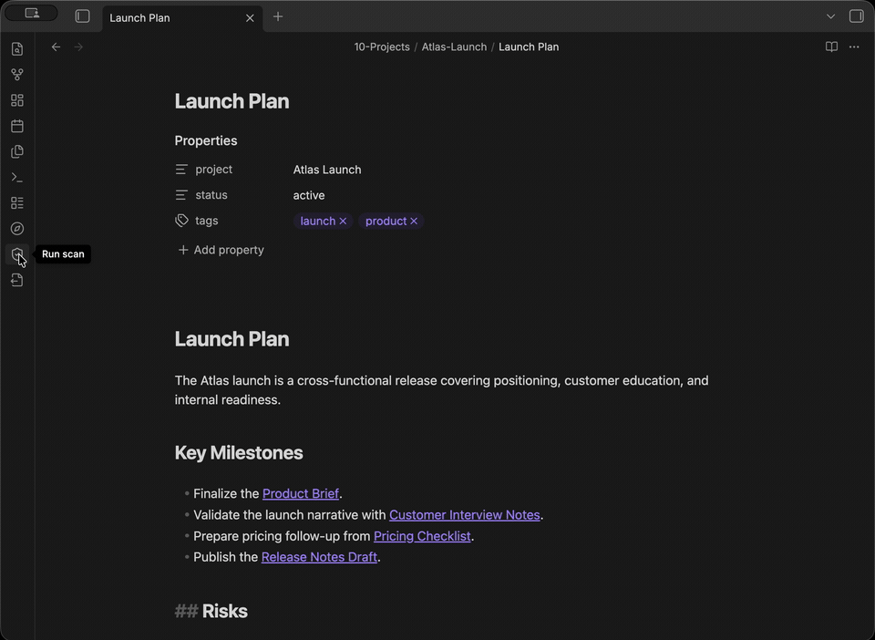

# Vault Inspector

Scan your Obsidian vault for maintenance problems: broken links, missing attachments, orphan files, duplicate files, empty notes, tag issues, and large files.

Use it before publishing, exporting, migrating, or cleaning up a long-lived vault.



## What it checks

- **Broken Links** — Detect wiki links, markdown links, and embeds pointing to non-existent notes or headings.
- **Orphan Attachments** — Find images, PDFs, audio/video, and archives not referenced by any note.
- **Empty Notes** — Flag notes with no meaningful content beyond frontmatter and title.
- **External Links** — Optionally check external URLs for availability (HTTP status).
- **Duplicate Files** — Identify duplicates by name, size, and optional SHA-256 content hash.
- **Frontmatter Types** — Report properties used with inconsistent value types across notes.
- **Tag Usage** — Watch for missing or underused tags from a configurable watchlist.
- **Large Files** — Flag Markdown files and attachments exceeding configurable size thresholds.

### Broken Links

Supports wiki links (`[[Note]]`), aliased links (`[[Note|Display]]`), heading links (`[[Note#Section]]`), markdown links, and embeds (`![[image.png]]`).

- `error` — unresolved link target
- `warning` — missing heading in existing note

Broken link detection relies on Obsidian's metadata cache; links inside code blocks or comments may be missed.

### Orphan Attachments

Scans for attachment files not referenced by any Markdown file.

- `warning` — unreferenced file older than 24 hours
- `info` — unreferenced file modified within 24 hours
- Supported: png, jpg, jpeg, gif, webp, svg, pdf, mp3, mp4, wav, mov, zip

Orphan detection cannot account for references from CSS, Canvas, Dataview queries, or external tools.

### Empty Notes

Flags notes that have no content beyond frontmatter and a title heading.

- `warning` — empty note

### External Links

Opt-in scanner for checking HTTP/HTTPS URLs found in notes for availability. It is disabled by default because it makes network requests and depends on external sites, DNS, and rate limits.

- `warning` — HTTP status 400 or higher
- `info` — timed out, failed, or skipped URL checks
- Checks Markdown links, frontmatter links, images/embeds, and bare HTTP/HTTPS URLs in note bodies.
- Timeouts or blocked requests do not necessarily mean a URL is dead.

### Duplicate Files

Groups files by basename + extension, then by size. Files below the hash cap are verified with SHA-256.

- `warning` — hash-identical files
- `info` — same-name or same-size candidates without hash

Deletion is offered only for files confirmed identical by content hash. By
default, Vault Inspector asks which file to keep. Automatic mode keeps the first
complete vault-relative path in alphabetical order. Modification time, access
time, and file size do not choose the keep file.

Duplicate detection above the hash cap reports candidates only (no content verification).

### Frontmatter Type Inconsistencies

Reports keys used with incompatible value types across notes.

- `warning` — incompatible types (e.g., string vs array)
- `info` — string vs date-like ambiguity

### Tag Usage

Reports watched tags not present in the vault, and tags below a usage threshold.

- `info` — all tag issues

### Large Files

Flags files exceeding configurable size thresholds.

- `warning` — file above threshold
- Markdown files with configured frontmatter keys, such as Excalidraw files, can be excluded from this scanner.

Excalidraw Markdown files are ignored by default when they include the
`excalidraw-plugin` frontmatter key. If your vault uses filename-based Excalidraw
files without that frontmatter, add a path pattern such as
`**/*.excalidraw.md` to **Ignored large Markdown path patterns**.
You can use the same path patterns for other generated or workflow-specific
Markdown files, for example `index/**/*.md` or `exports/**/*.md`.

## Install in Obsidian

### Community Plugins

Search **Vault Inspector** in Obsidian → Settings → Community plugins → Browse.

### Manual

Download `main.js`, `manifest.json`, and `styles.css` from the [latest release](https://github.com/rogerdigital/vault-inspector/releases) and place them in `.obsidian/plugins/vault-inspector/`.

## Use in Obsidian

The core workflow is: run a scan, review new findings, then fix or ignore each one.

1. Open the command palette and run **Vault Inspector: Run scan**.
2. The Inspector view opens in the right sidebar and shows scan progress while the scanners run.
3. The summary highlights how many findings are new since the last comparable scan. Click **Review new findings** to focus the list on confirmed new findings.
4. Filter results by scanner, severity, lifecycle, or classification. Expand **Technical evidence** to inspect the raw scanner evidence behind the explanation.
5. Click paths, URLs, targets, properties, or tags to jump to the relevant location.
6. Open a finding's **Actions** menu to ignore it, choose **Exclude parent folder**, or open its scanner settings. Parent-folder exclusions apply only to that scanner and can be removed from **Scanner-specific ignored folders** in settings.
7. Expand **Filter and select**, then click **Select findings** to enter selection mode and batch delete or ignore issues.
8. Expand **Resolved items** to review read-only rows from the previous compatible successful scan. Expand **Ignored items** to restore previously ignored issues.
9. Run **Vault Inspector: Export report** to save results as Markdown. When a
   complete in-vault report would exceed 1 MiB, choose a compact summary,
   explicitly export the complete report anyway, or cancel.

Scan results are selectable for copying. Duplicate file results show each file
separately, tag results show `#tag` chips, and exported Markdown reports include
scanner-specific detail fields.

Plugin exports measure the complete Markdown output before writing into the
vault. Reports larger than 1 MiB require an explicit choice because large
Markdown files may make Obsidian unresponsive while indexing. Summary exports
keep scan totals and per-scanner counts but omit per-finding details. This
in-vault protection does not change CLI Markdown output.

Each finding carries a confidence label — **Confirmed**, **Needs review**, or
**Could not verify** — and a plain-language explanation: why it was reported, an
optional caveat, and a suggested next step. Raw evidence remains available
separately for deeper inspection.

Lifecycle comparison is available only after a successful scan and only when the
previous successful scan used the same detection profile. The first successful
scan establishes a baseline; changing detection settings or scanner semantics
also establishes a new baseline instead of marking every finding as new. Ignoring
a finding does not resolve it: ignored findings remain part of the active
lifecycle comparison. Resolved rows are read-only historical records from the
previous compatible snapshot, not current findings or proof that an action fixed
them.

## How safe fixes work

Vault Inspector is read-only by design: scans never modify, move, or delete
vault files. The only writes are exported Markdown reports and fixes you
explicitly confirm.

Fixes run only after explicit confirmation. Before anything happens, a
confirmation dialog lists every planned fix and its impact — the files it will
move to trash, the link text it will remove, and the references around them.

Each fix is preflight-checked against a fresh scan of the affected files:

- **Ready to fix** — the finding is confirmed and its evidence is complete, so the fix can run from the confirmation dialog.
- **Review before fixing** — the fix needs a decision first, for example choosing which of several referenced duplicate copies to keep, or reviewing a finding that was not fully verified.
- **Fix unavailable** — the fix cannot run safely in the current state, for example when some references could not be checked or the finding could not be verified.

After you confirm, every attempted fix is verified against fresh scan data and
reported as **Fixed**, **Still present**, **Skipped**, or **Failed**. Fix results
remain visible until dismissed.

Fix actions can be turned off entirely in settings. Batch delete moves files to
Obsidian's trash; it never permanently deletes them.

## Settings

| Setting | Default | Description |
|---|---|---|
| Enabled Scanners | All local scanners on; External Links off | Toggle individual scanners |
| Enable fix actions | On | Allow batch delete of fixable issues |
| Duplicate file keep mode | Always ask | Require a keep-file choice, or automatically keep the alphabetically first vault-relative path |
| Large Markdown threshold | 100 KB | Markdown files above this size are flagged |
| Large attachment threshold | 5 MB | Attachments above this size are flagged |
| Ignored large Markdown frontmatter keys | excalidraw-plugin | Markdown files with these frontmatter keys are excluded from large file checks |
| Ignored large Markdown path patterns | (none) | Vault-relative glob patterns excluded from large Markdown checks |
| Duplicate hash cap | 1 MB | Max file size for content hash comparison |
| Empty note word threshold | 5 | Notes with fewer words (excluding frontmatter/title) are flagged |
| Watched tags | (none) | Tags to watch for missing usage |
| Low usage tag threshold | 2 | Tags below this count are flagged |
| Ignored folders | (none) | Folders excluded from every scanner |
| Scanner-specific ignored folders | (none) | Additional folders excluded only from the selected scanner |
| Ignored properties | (none) | Frontmatter properties excluded from type checks |
| Report folder | Vault Inspector Reports | Folder for exported Markdown reports |

Global ignored folders apply to every scanner. Scanner-specific ignored folders
are additional exclusions. For example, add `syncTrash` only to Broken Links if
you want Duplicate Files to inspect that folder while broken-link checks skip it.

## Optional CLI automation

The same scanner logic is available as a read-only terminal scanner for local
vaults, automation, and CI workflows:

```bash
npx vault-inspector /path/to/your/vault
```

Or install it globally:

```bash
npm install -g vault-inspector
vinspect /path/to/your/vault
```

CLI scan mode is read-only: it never modifies, moves, or deletes vault files.
For all flags, configuration, the JSON protocol, baseline comparison, and exit
codes, read the [CLI reference](docs/cli.md).

## Privacy and network access

Vault Inspector does not make network requests unless the External Links scanner is enabled. That scanner checks URLs you explicitly have in your notes. In Obsidian this uses Obsidian's `requestUrl`; in the CLI it uses HTTP HEAD requests through the runtime `fetch` API. No vault content leaves your device beyond those link-check requests.

Vault Inspector enumerates vault files and Markdown metadata so scanners can detect
broken links, orphan attachments, duplicate files, large files, tag usage, and
frontmatter type drift. This access is local and read-only during scans.

## Development

```bash
npm install
npm run dev       # watch mode
npm run lint      # eslint
npm run lint:obsidian-warnings # Obsidian review warning checks
npm run build     # production build
npm test          # unit tests
npm pack --dry-run # inspect npm package contents, including cli.js
```

## License

[MIT](LICENSE)
