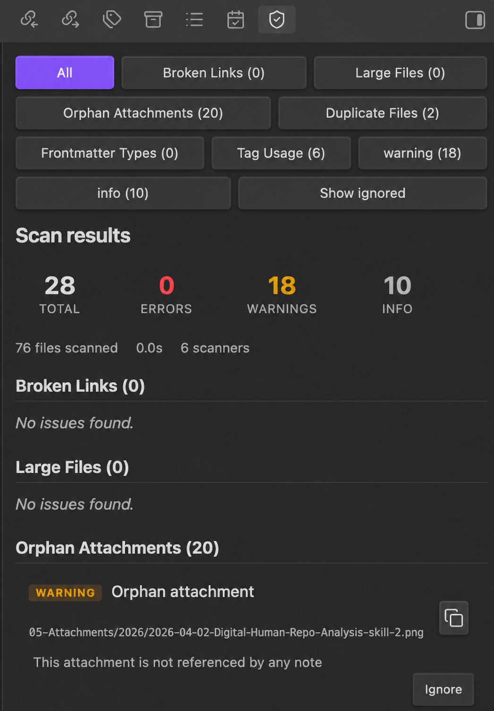

# Vault Inspector

Scan your Obsidian vault for maintenance problems — broken links, orphan attachments, duplicate files, frontmatter inconsistencies, unused tags, and large files — without modifying anything.



## Features

- **Broken Links** — Detect wiki links, markdown links, and embeds pointing to non-existent notes or headings.
- **Orphan Attachments** — Find images, PDFs, audio/video, and archives not referenced by any note.
- **Duplicate Files** — Identify duplicates by name, size, and optional SHA-256 content hash.
- **Frontmatter Types** — Report properties used with inconsistent value types across notes.
- **Tag Usage** — Watch for missing or underused tags from a configurable watchlist.
- **Large Files** — Flag Markdown files and attachments exceeding configurable size thresholds.

## Install

### Community Plugins

Search **Vault Inspector** in Obsidian → Settings → Community plugins → Browse.

### Manual

Download `main.js`, `manifest.json`, and `styles.css` from the [latest release](https://github.com/rogerdigital/vault-inspector/releases) and place them in `.obsidian/plugins/vault-inspector/`.

## Usage

1. Open the command palette and run **Vault Inspector: Run scan**.
2. The Inspector view opens in the right sidebar.
3. Filter results by scanner or severity. Click a file path to open it.
4. Click **Ignore** to suppress a specific issue in future scans.
5. Run **Vault Inspector: Export report** to save results as Markdown.

## Scanners

### Broken Links

Supports wiki links (`[[Note]]`), aliased links (`[[Note|Display]]`), heading links (`[[Note#Section]]`), markdown links, and embeds (`![[image.png]]`).

- `error` — unresolved link target
- `warning` — missing heading in existing note

### Orphan Attachments

Scans for attachment files not referenced by any Markdown file.

- `warning` — unreferenced file older than 24 hours
- `info` — unreferenced file modified within 24 hours
- Supported: png, jpg, jpeg, gif, webp, svg, pdf, mp3, mp4, wav, mov, zip

### Duplicate Files

Groups files by basename + extension, then by size. Files below the hash cap are verified with SHA-256.

- `warning` — hash-identical files
- `info` — same-name or same-size candidates without hash

### Frontmatter Type Inconsistencies

Reports keys used with incompatible value types across notes.

- `warning` — incompatible types (e.g., string vs array)
- `info` — string vs date-like ambiguity

### Tag Usage

Reports watched tags not present in the vault, and tags below a usage threshold.

- `info` — all tag issues

### Large Files

Flags files exceeding configurable size thresholds.

- `warning` — file above threshold

## Settings

| Setting | Default | Description |
|---|---|---|
| Enabled Scanners | All on | Toggle individual scanners |
| Large Markdown threshold | 100 KB | Markdown files above this size are flagged |
| Large attachment threshold | 5 MB | Attachments above this size are flagged |
| Duplicate hash cap | 1 MB | Max file size for content hash comparison |
| Watched tags | (none) | Tags to watch for missing usage |
| Low usage tag threshold | 2 | Tags below this count are flagged |
| Ignored folders | (none) | Folders excluded from all scans |
| Ignored properties | (none) | Frontmatter properties excluded from type checks |
| Report folder | Vault Inspector Reports | Folder for exported Markdown reports |

## Privacy

Vault Inspector does not make network requests. All processing happens locally using Obsidian APIs. No data leaves your device.

## Limitations

- Read-only — does not modify, move, or delete vault files (except exported reports).
- Broken link detection relies on Obsidian's metadata cache; links inside code blocks or comments may be missed.
- Orphan detection cannot account for references from CSS, Canvas, Dataview queries, or external tools.
- Duplicate detection above the hash cap reports candidates only (no content verification).

## Development

```bash
npm install
npm run dev       # watch mode
npm run build     # production build
npm test          # unit tests
```

## License

[MIT](LICENSE)
